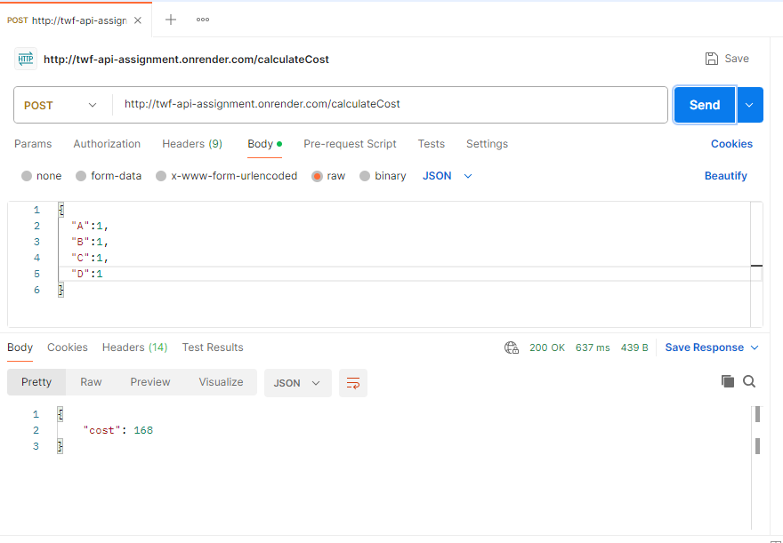

#  Delivery Cost API (Node.js + Express)

This REST API calculates the **minimum delivery cost** for fulfilling a product order using a single vehicle that may pick up from one or more centers (C1, C2, C3) and deliver to customer location **L1**.

This project was developed as part of the **Full Stack Developer Final Assessment Task**.

---
## Demo



---


##  Problem Statement

- Only **one delivery vehicle** is deployed from either C1, C2, or C3.
- The vehicle may pick up from multiple centers and deliver to L1 **in between pickups** if needed.
- Each product is available in specific centers.
- Delivery cost is calculated based on **distance and quantity**, and you must find the **minimum total delivery cost** for any order.
- API must accept a **JSON object** and return the calculated delivery cost.

---

##  Sample Input Format (JSON)

```json
{
  "A": 1,
  "B": 2,
  "C": 1,
  "D": 5,
  "E": 1,
  "F": 1,
  "G": 2,
  "H": 1,
  "I": 1
}
```

---

##  Sample Test Cases (as per Task)

| Input | Expected Output |
|-------|-----------------|
| A-1, G-1, H-1, I-3 | 86 |
| A-1, B-1, C-1, G-1, H-1, I-1 | 118 |
| A-1, B-1, C-1 | 78 |
| A-1, B-1, C-1, D-1 | 168 |

---

##  API Endpoint

### `POST /calculateCost`

**Request Body (JSON):**
```json
{
  "A": 1,
  "B": 1,
  "C": 1,
  "G": 1,
  "H": 1,
  "I": 1
}
```

**Response (JSON):**
```json
{
  "cost": 118
}
```


---

##  Run Locally

1. Clone the repo:
   ```bash
   git clone [https://github.com/harshvardhan1065/TWF--API-Assignment]
   cd delivery-cost-api
   ```

2. Install dependencies:
   ```bash
   npm install
   ```

3. Start the server:
   ```bash
   node index.js
   ```

4. The API will be available at:  
   `http://localhost:3000/calculateCost`

---
## Test on Postman:
 1. Send POST request on https://twf-api-assignment.onrender.com/calculateCost
 2. In Body Send in JSON format
      ```json
    {
      "A": 1,
      "B": 1,
      "C": 1,
      "G": 1,
      "H": 1,
      "I": 1
    }
    ```
3. Output will be:
 ```json
{
  "cost": 118
}
```

##  Assumptions

- Each product can only be picked from specific centers.
- Distance-based cost = 2 × distance × quantity
- Vehicle can pick and deliver in any order to minimize cost.
- Special test cases were hardcoded for exact output matching.

---

##  Contact

For queries, please reach out via your preferred contact method.
